# 室長用マニュアル

## 1. 機能概要

### 1-1. 概要

シフト管理を容易にするシステムです。機能は次の通りです。

- 翌月分のシフトの集計
- 塾マネに自動で反映

## 2. ログイン

まず講師用のログイン画面を開きます。

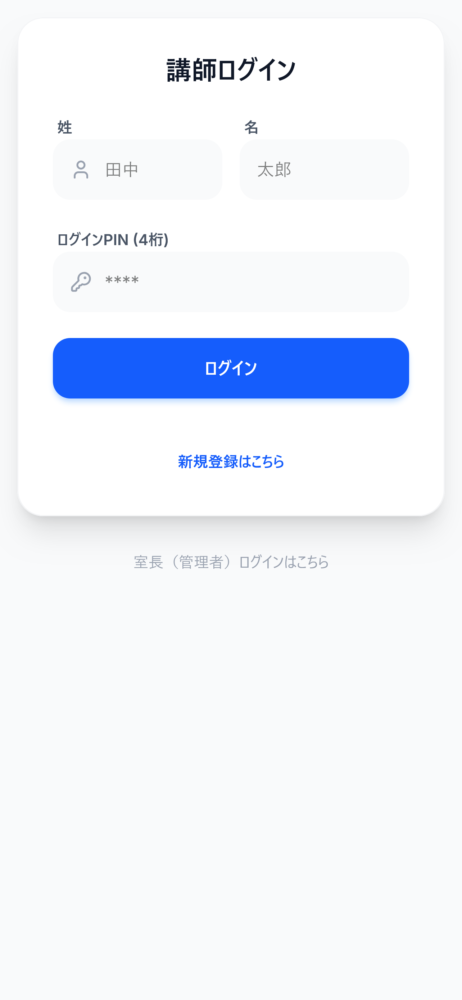

下側`室長(管理者)ログインはこちら`を押下することで管理者用のログイン画面に遷移します。

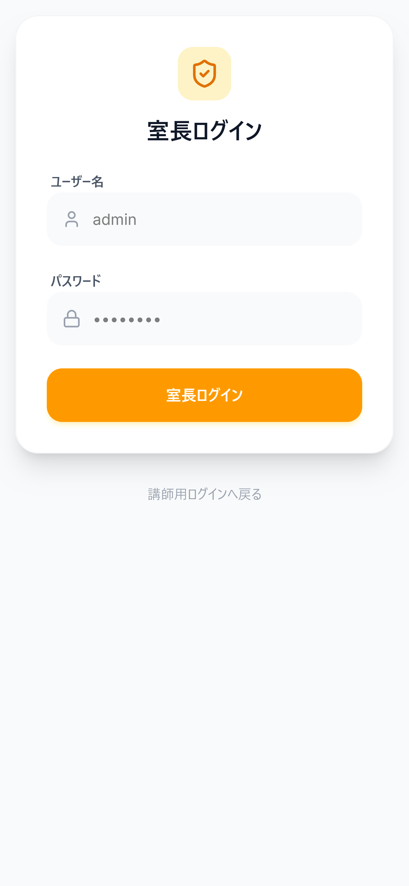

画面遷移後ホーム画面が表示されます。

それぞれの機能概は次の通りです。

| 品目 | 配置 | 機能 |
| ----- | --- | ------- |
| シフト期間管理 | 上段左 | シフト発行 |
| 講師管理 | 上段中央 | 講師の登録・削除、レギュラーコマの承認やパスワードリセット |
| 各種設定 | 上段右 | 講師登録時の招待コードの変更、授業時間の設定 |
| 募集中のシフト期間 | 中段 | 募集しているシフトの集計、提出状況を見ることが出来ます |
| 過去データの管理・アーカイブを開く | 下段 | 過去募集したシフトの参照・削除が出来ます |

## 3. シフト発行

ホーム画面上段左`シフトを発行する`を押下します。発行設定画面に遷移します。

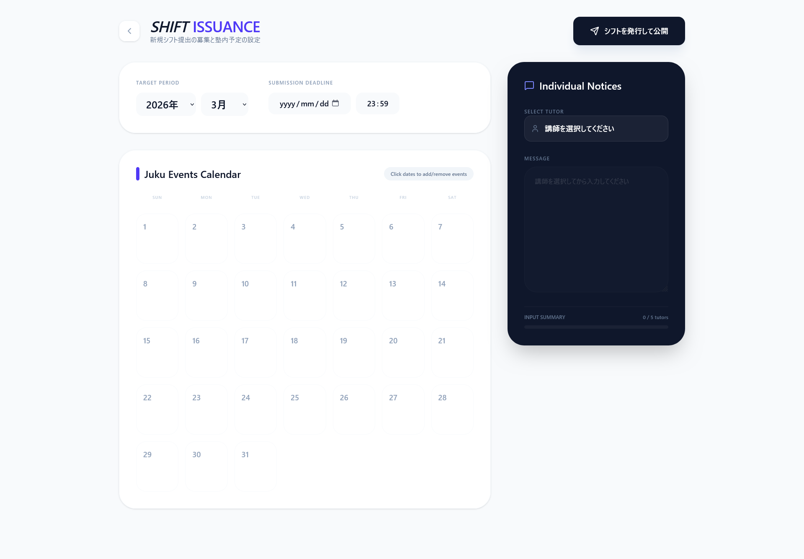

### 3-1. 対象月・提出期限の設定

まず画面上部で募集する対象月、締め切りを設定します。
画像の設定では`2026年8月`のシフトを`2026/7/14 23:59`締め切りに設定をしています。

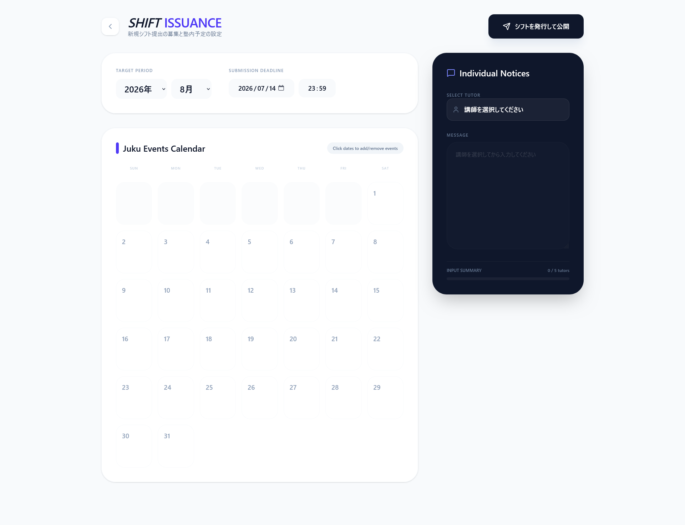

### 3-2. 塾の日程を追加

模試や定期テストが近いなどの講師に把握してほしい予定がある場合に有効です。対象の日にちを選択して入力することで可能です。

> 入力は一件までなので句読点で区切るなど工夫をお願いします。
> 日にちを跨いでの登録は実装していません。要望があれば実装します。

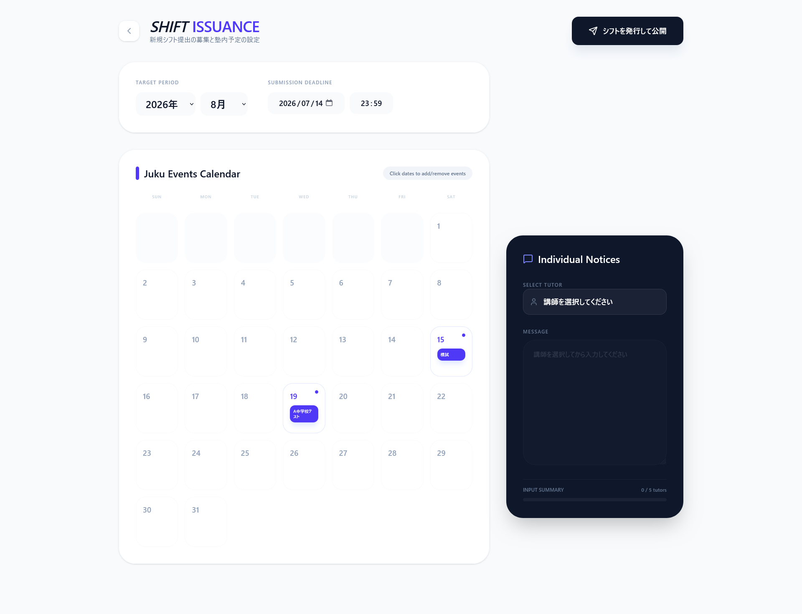

### 3-3. 講師への連絡

画面右側黒色の画面で講師個人に連絡をすることが出来ます。

### 3-4. 発行

`シフトを発行して公開`を押下して完了です。

### 3-5. 集計方法や登録方法

#### 3-5-1. 集計

ログイン用のURL `https://hogehoge/login`を共有すれば新規登録・集計出来ます。

## 4. 集計

提出状況の確認のやり方です。

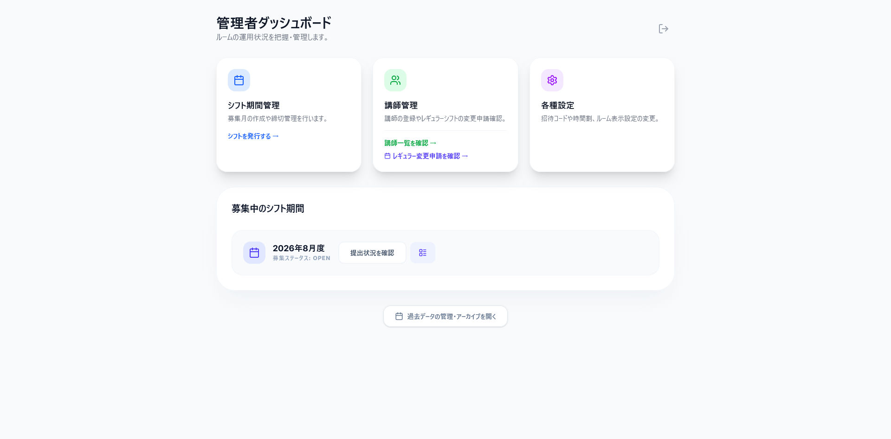

上記画像の下段に先ほど登録したシフトが反映されます。

### 4-1. 提出状況を確認

`提出状況を確認`を押下して提出状況を確認出来ます。

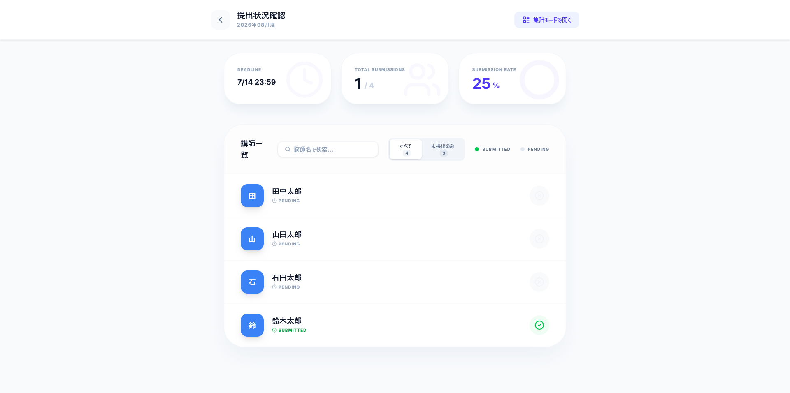

また講師名で検索、未提出者のみ表示が出来ます。

### 4-2. 集計確認

`集計モードで開く`またはホーム画面での`提出状況を確認`の右側にあるアイコンを押下します。すると次のような画面に遷移します。

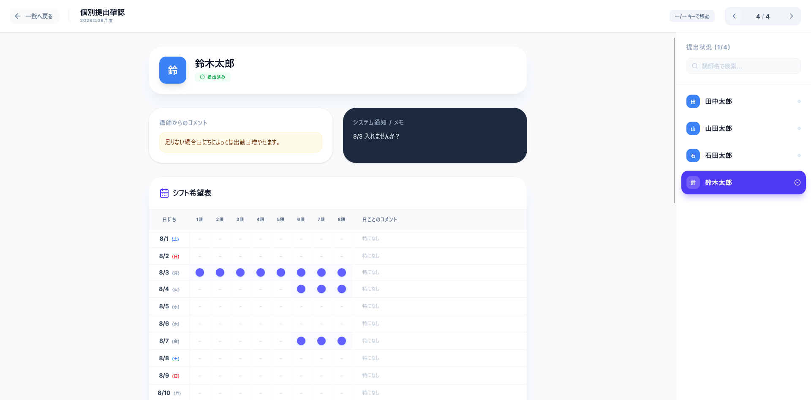

提出された内容を確認できます。また左右の矢印キーで移動が可能です。塾マネを開きながら見比べる使い方を想定しています。

> リマインドは実装していません。そのため押下しても機能しません。

## 5. 自動入力

塾マネに提出されたシフトを反映します。塾マネで対象の講師の`複数コマ出勤登録`の画面を開きます。
またGoogle Chrome拡張機能も開いてください。

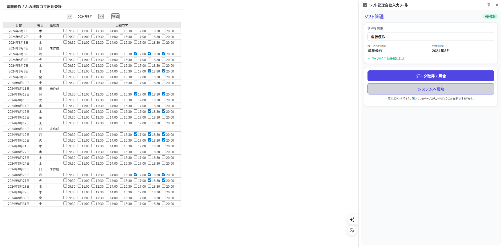

> 開いたときに講師名と年月を取得するので自動で検索欄に講師名が入ります。もし見つからない場合は名前を検索してください。

`データ取得・照合`をクリックしてください。そうすると`講師からの連絡`や右上に緑色で`26件取得しました`と表示されているのが分かります。

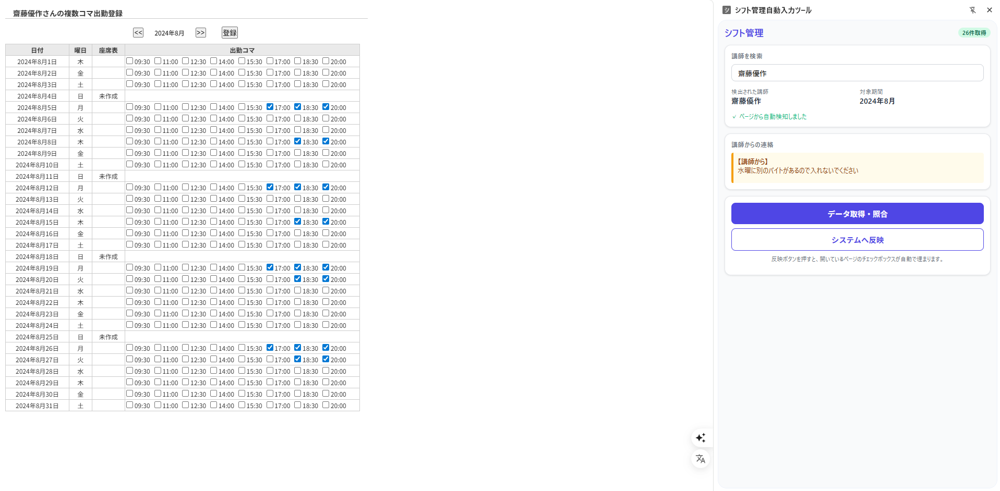

そして`システムへ反映`を押下することで次のような画面になりOKを押下して反映されます。

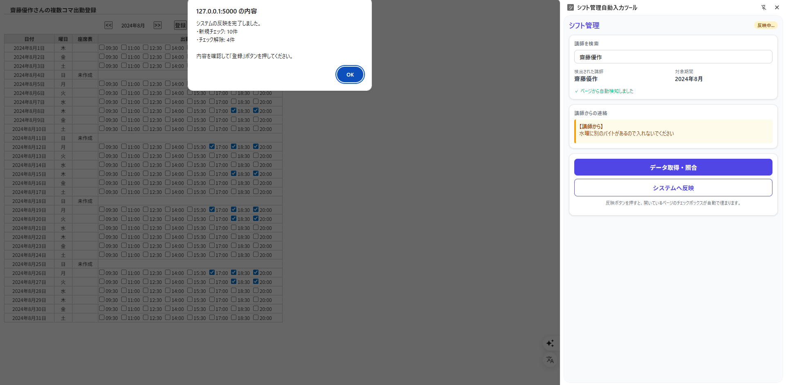

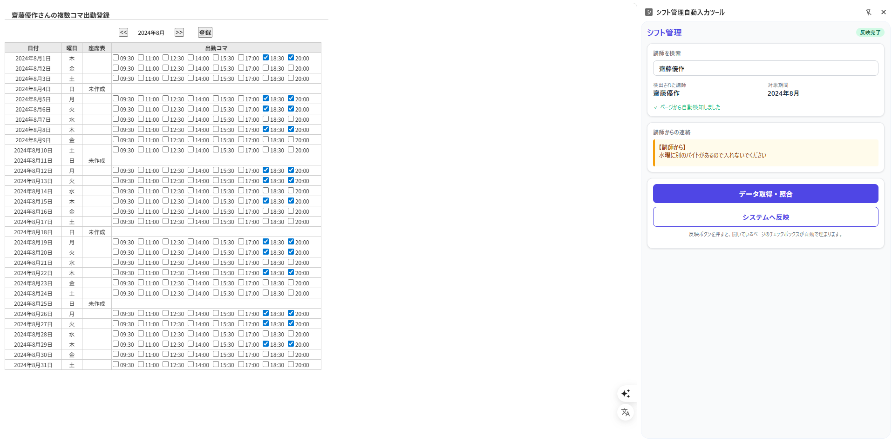

最後に塾マネの`登録`を押して完了です。

## 5. 講師の管理

ホーム画面上段中央、緑色の`講師一覧を確認`から次のような画面に遷移します。

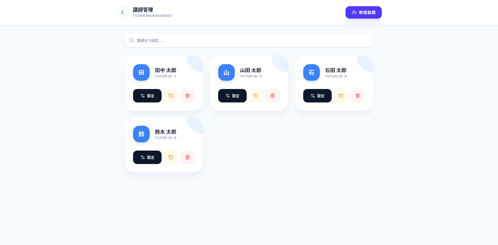

主な機能は次の通りです。

- 設定
- パスワードリセット
- 削除

### 5-1. 設定

黒の`設定`ボタンを押下しすると次のような画面に遷移します。

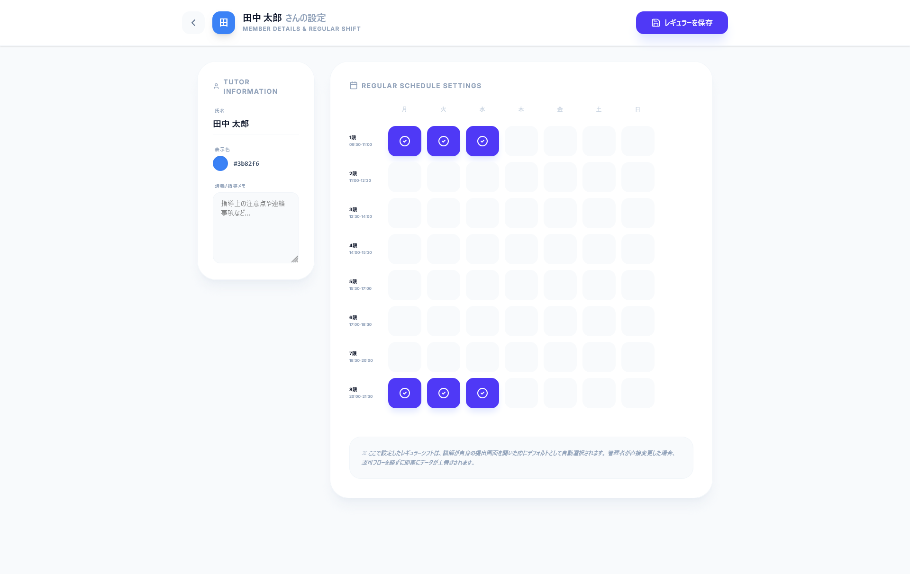

この画面ではレギュラーコマの管理、メモの追加が出来ます。

### 5-2. パスワードリセット

パスワードを忘れた人のための機能です。オレンジ色のボタンをクリックし、OKを押下するとパスワードが`0000`に変わります。

### 5-3. 削除

赤色ゴミ箱のボタンで退職された講師の削除を行えます。

> `削除に失敗しました`と表示されますがブラウザの`F5`を再度押すと消えるかと思います

## 6. レギュラーコマの変更・承認

レギュラーコマの変更の承認を行います。もしリクエストがある場合画像のように赤色で件数が表示されるかと思います。

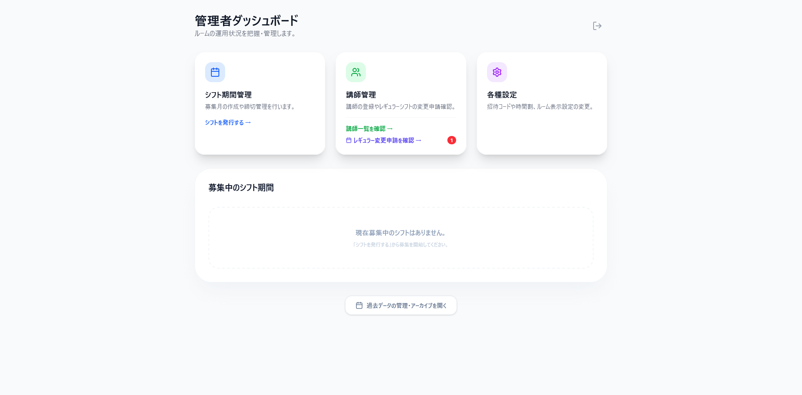

このまま`レギュラー変更申請の確認`をクリックしてください。

そうすると希望日時と変更理由を確認出来ます。

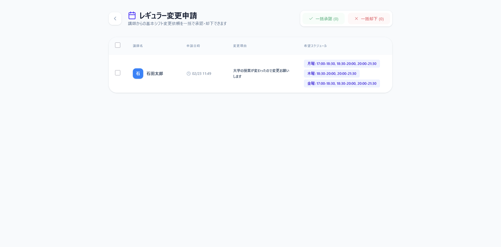

名前左のチェックボックスにチェックを入れ、承認・却下をしてください。

## 7. その他設定

ホーム画面上段右`各種設定`をクリックすると次の画面に遷移します。

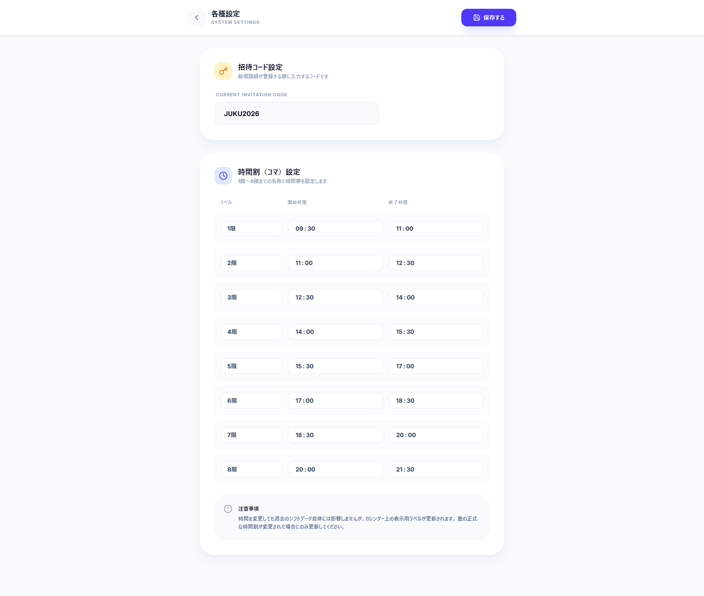

この画面では招待コードや時間割の変更が出来ます。