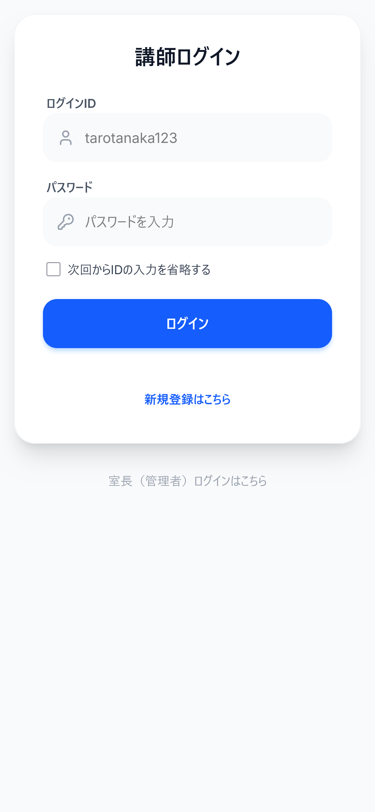
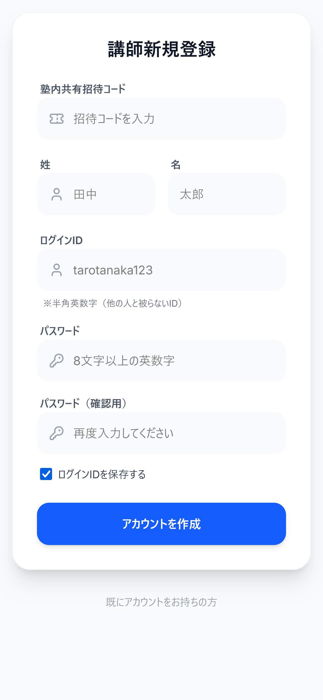
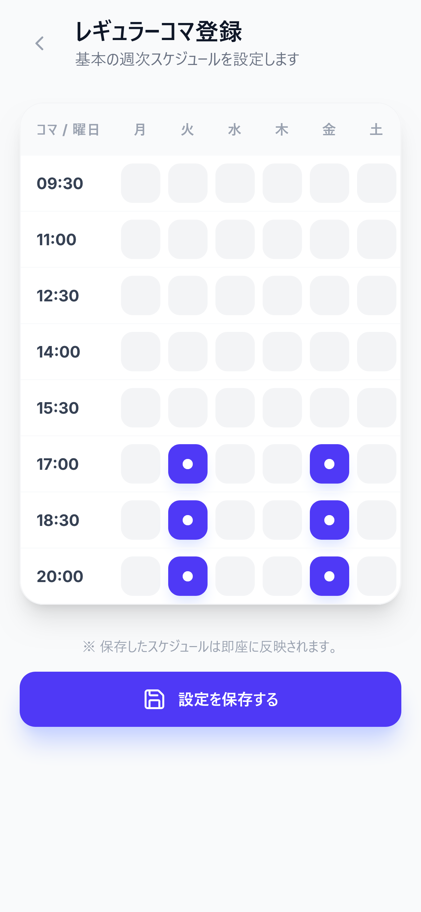
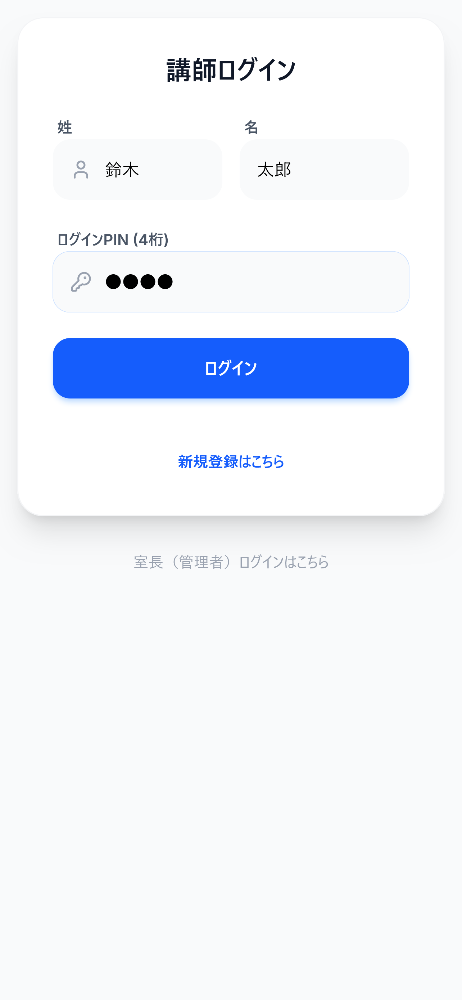
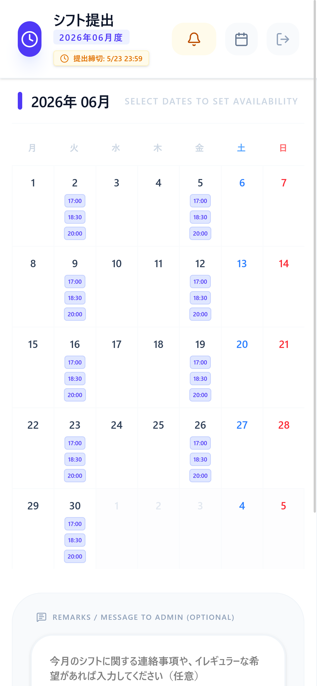
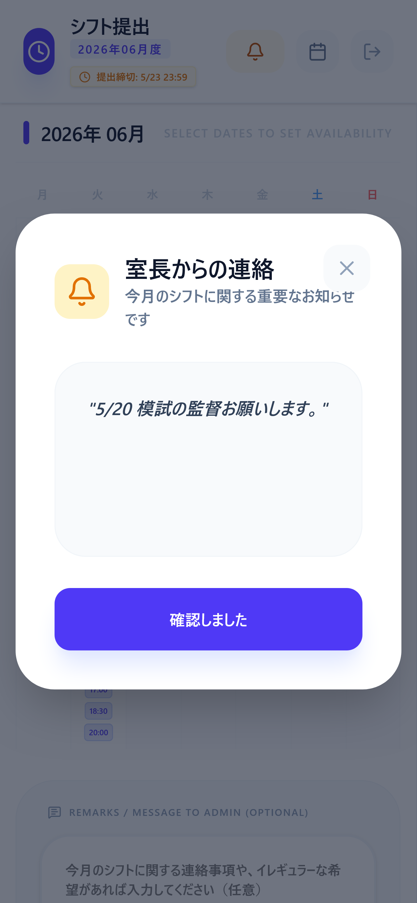
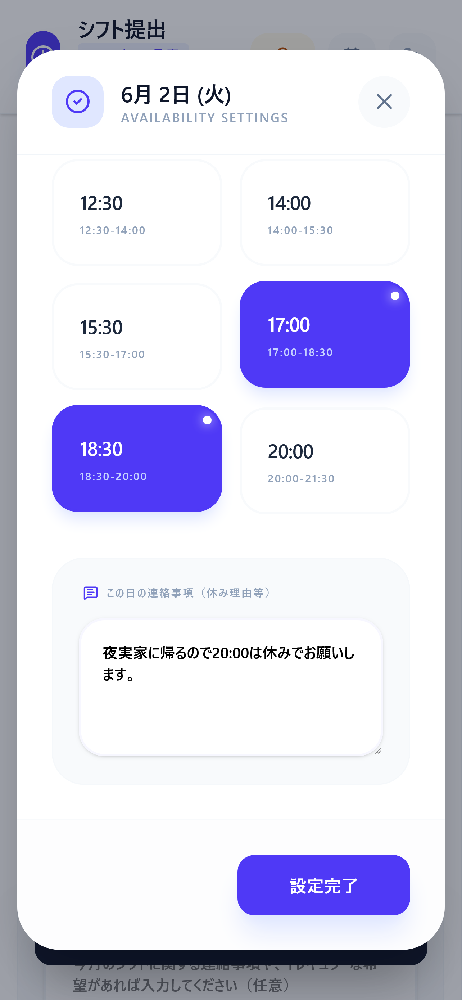
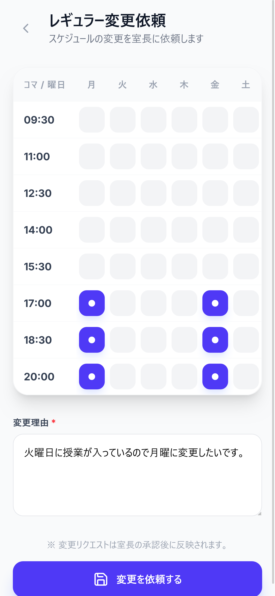
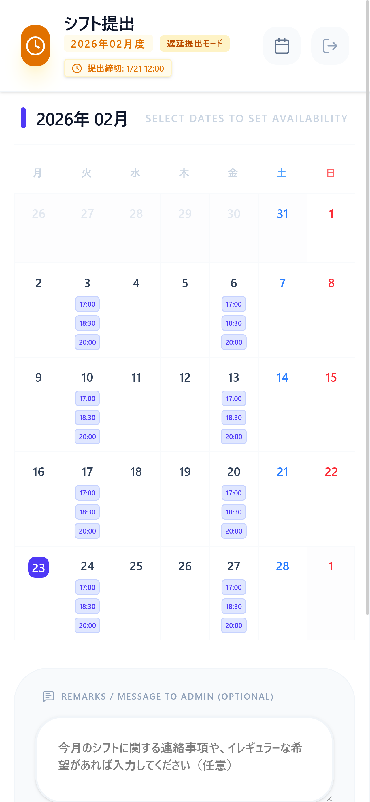

# 講師用マニュアル

## 1. アカウント登録

### 1-1. アカウント作製

`URL`にアクセスしたときこのように表示されているので`ログイン`の下側`新規登録はこちら`をクリック

講師新規登録という画面になるので**招待コード**及び**苗字**と**名前**、**ログイン用の4桁の数字**を入力して`アカウント作成`を押下。

### 1-2. レギュラーコマの登録

アカウント作成後レギュラーコマの画面に遷移します。

出勤日選択後`設定を保存する`を押下することで登録できます。ここで登録したレギュラーコマは変更も可能です。詳しくは[3. レギュラーコマ変更](#3-レギュラーコマ変更)を参照してください。

## 2. シフト提出

### 2-1. ログイン

[1-1. アカウント作成](### 1-1. アカウント作成)で登録した情報**苗字、名前、4桁の数字**を入力してログインしてください。

### 2-2. シフト提出

ログイン後シフト提出が行える状態なら次のようなカレンダーの画面になります。

画面上部の機能は左から次の通りです。

- 室長から講師への連絡
- レギュラーコマ変更リクエスト
- ログアウト

このとき室長から個別に連絡がある場合、次のような表示にもなります。

`X`を押下して閉じることができ、再度確認したい場合は**ベル**のボタンを押下して開くことが出来ます。
元から入力済みの日時はレギュラーコマで登録した内容となります。

### 2-3. 出勤日の登録

該当する日にちをクリックすると**時間,連絡**を入力できます。出勤出来る時間を選択や、連絡事項等を記入して`設定完了`を押下してください。

最後に`講師から室長への連絡事項`があれば記載をして`変更があれば保存して提出`を押下すれば完了です。

## 3. レギュラーコマ変更

画面上部アイコン3つの中央`カレンダー`アイコンを押下するとレギュラーコマの変更が行えます。

`変更理由`を記入して`変更を依頼する`ボタンを押下して完了です。

> 変更は室長の承認が必要です

## 4. 遅延提出

提出期限を過ぎてもシフトの提出は可能です。極力ないようにしましょう。

### 4-1. 遅延提出方法

シフト提出の期限が無い場合次のような画面が表示されます。

`遅れて提出・修正する場合はこちら`を押下すると直近のシフト表が確認できます。

先ほどと同様の手順で提出が可能です。

## 5. その他

### 5-1. ログインのパスワードを忘れてしまった場合

室長に連絡することでパスワードリセットが出来ます。

